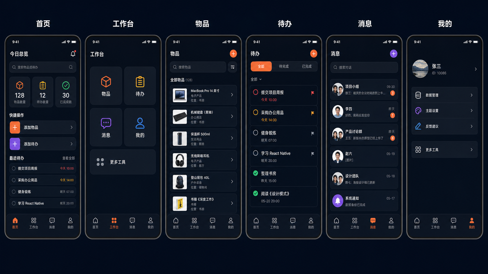
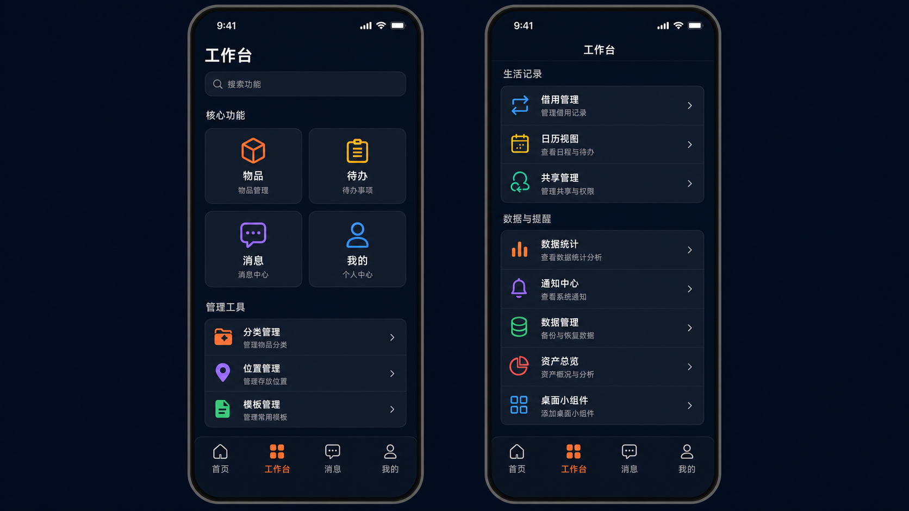
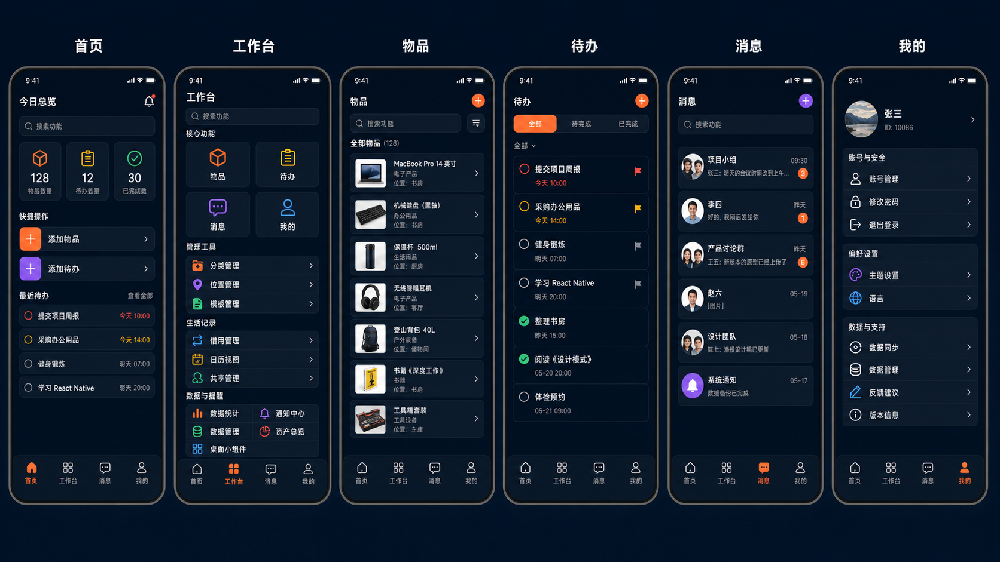
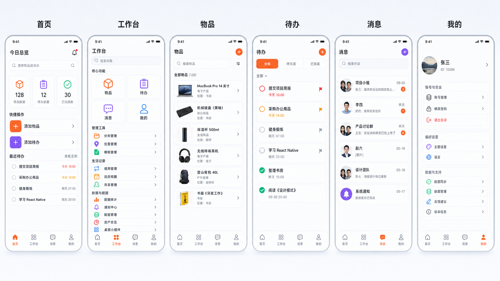

# LifeTracker 第二阶段 UI 设计 Handoff

> 状态: 待确认  
> 日期: 2026-06-28  
> 阶段: UI 规范、线框原型、高保真方案、开发交接  
> 前置依据: [PRD.md](./PRD.md), [HANDOFF_STAGE_1_PRD.md](./HANDOFF_STAGE_1_PRD.md)  
> Figma 设计源: [LifeTracker v1.4 UI Redesign Handoff](https://www.figma.com/design/5Jf46ubRueu1vhNkmgoyNK)  
> Figma 交付说明: [FIGMA_HANDOFF.md](./FIGMA_HANDOFF.md)  
> 高清设计板: [lifetracker-v1.4-design-board.html](./design/lifetracker-v1.4-design-board.html)  
> 高保真概念图: [lifetracker-v1.4-hifi-concept.png](./design/lifetracker-v1.4-hifi-concept.png)
> 工作台分组概念图: [lifetracker-v1.4-workbench-grouped-concept.png](./design/lifetracker-v1.4-workbench-grouped-concept.png)
> 深色整体效果图: [lifetracker-v1.4-overview-dark.png](./design/lifetracker-v1.4-overview-dark.png)
> 浅色整体效果图: [lifetracker-v1.4-overview-light.png](./design/lifetracker-v1.4-overview-light.png)

## 1. 设计目标

本阶段将 LifeTracker 从“功能堆叠型移动应用”重构为“深色生活操作台”。本轮设计源已切换为 Figma-first；高清 HTML 设计板保留为离线参考，第三阶段 1:1 还原以 Figma 为准。图片稿只作为方向参考，不再作为第三阶段实现依据。核心目标：

- 降低重复入口造成的认知负担。
- 用统一深色/浅色双主题设计系统覆盖首页、工作台、物品、待办、消息、我的六个核心屏幕。
- 保留高频路径的直接性：添加物品、添加待办、搜索、消息、账号设置。
- 将全部功能入口直接平铺到工作台分组里，避免首页和我的重复铺开，也避免“更多工具”二次跳转。
- 我的页同样采用外层平铺：账号与安全、偏好设置、数据与支持直接可见。
- 为第三阶段编码提供完整的视觉、布局、组件、交互参数。

## 2. Figma 高保真方案

### 2.1 Figma 源文件

第三阶段前端实现以 Figma 文件为唯一视觉源：

- 文件: [LifeTracker v1.4 UI Redesign Handoff](https://www.figma.com/design/5Jf46ubRueu1vhNkmgoyNK)
- `00 Handoff`: 改版目标、阶段说明、入口规则。
- `01 Foundations & Components`: 深浅色 token、字体、间距、圆角、组件参考。
- `02 Screens & Interactions`: 深色整体、浅色整体、列表/新增/编辑交互页。
- 关键节点见 [FIGMA_HANDOFF.md](./FIGMA_HANDOFF.md)。

当前 Figma 文件已补齐 3 页内容，关键节点见 [FIGMA_HANDOFF.md](./FIGMA_HANDOFF.md)。高清设计板用于离线参考： [lifetracker-v1.4-design-board.html](./design/lifetracker-v1.4-design-board.html)。设计图片仅用于记录前期方向探索；若图片、HTML 设计板与 Figma 有差异，以用户确认后的 Figma 为准。

### 2.2 参考设计图



### 2.3 工作台分组补充参考图



### 2.4 深浅色整体参考图





### 2.5 设计源约束

- Figma 中的头像、物品图片、数量、用户 ID、对话内容均为占位示例，编码时必须接现有真实数据源。
- Figma 中的核心屏为视觉基准：`首页`、`工作台`、`物品列表`、`待办列表`、`消息`、`我的`、`新增/编辑物品`、`新增/编辑待办`、`数据管理`、`账号管理`、`工具交互`。
- Figma 覆盖核心审稿范围：深色整体、浅色整体、工作台平铺、我的外层平铺、物品列表/新增/编辑、分类列表、借用编辑、数据统计。
- 工作台分组为所有收拢模块的入口基准：`分类管理`、`位置管理`、`模板管理`、`借用管理`、`日历视图`、`共享管理`、`数据统计`、`通知中心`、`数据管理`、`资产总览`、`桌面小组件`。
- 深色和浅色 Figma 画板共同作为主题验收依据；第三阶段不能只实现其中一种。
- 底部导航固定为四项：`首页`、`工作台`、`消息`、`我的`。
- `物品` 和 `待办` 不是一级 Tab，仍通过工作台和首页快捷动作进入独立 Stack 页面。
- 项目整体模块不再输出独立详情页效果；无特殊要求时只设计和实现列表、新增、编辑。
- 未经确认，不新增页面、不新增一级导航、不恢复已收拢的重复入口。

## 3. 设计系统

### 3.1 色彩 Token

#### 深色模式

| Token | Hex | 用途 |
|---|---|---|
| `app.bg` | `#08111F` | 页面主背景、Tab 内容背景 |
| `app.bgElevated` | `#0B1424` | 深色渐变区域底色 |
| `app.surface` | `#0D1626` | 卡片、列表项、搜索框、底部导航 |
| `app.surfaceSoft` | `#121D2F` | 次级卡片、分段控制器背景 |
| `app.surfaceHover` | `#172235` | 按压态、选中前景 |
| `app.border` | `#243043` | 卡片边框、列表分割线 |
| `app.borderStrong` | `#33425A` | 聚焦边框、重要容器边框 |
| `text.primary` | `#FFFFFF` | 页面标题、主数值、主标签 |
| `text.secondary` | `#D5DCE7` | 正文、列表标题 |
| `text.muted` | `#8C98AA` | 描述、时间、说明 |
| `text.disabled` | `#596579` | 禁用态、低优先级信息 |
| `brand.orange` | `#FF8754` | 主操作、首页选中态、添加物品、物品模块 |
| `brand.violet` | `#8B68F5` | 消息、新建对话、待办辅助强调 |
| `semantic.success` | `#32D296` | 完成、成功、已完成待办 |
| `semantic.warning` | `#FBB329` | 中优先级、提醒、借用 |
| `semantic.danger` | `#FF6B7A` | 删除、紧急、错误 |
| `overlay.scrim` | `rgba(0, 0, 0, 0.48)` | Sheet、弹层遮罩 |

#### 浅色模式

| Token | Hex | 用途 |
|---|---|---|
| `app.bg` | `#F6F8FC` | 页面主背景、Tab 内容背景 |
| `app.bgElevated` | `#FFFFFF` | 顶部区域、主面板 |
| `app.surface` | `#FFFFFF` | 卡片、列表项、搜索框、底部导航 |
| `app.surfaceSoft` | `#EEF2F8` | 次级卡片、分段控制器背景 |
| `app.surfaceHover` | `#E6ECF5` | 按压态、选中前景 |
| `app.border` | `#DDE5F0` | 卡片边框、列表分割线 |
| `app.borderStrong` | `#B9C6D8` | 聚焦边框、重要容器边框 |
| `text.primary` | `#0F1724` | 页面标题、主数值、主标签 |
| `text.secondary` | `#334155` | 正文、列表标题 |
| `text.muted` | `#68758A` | 描述、时间、说明 |
| `text.disabled` | `#9AA7B8` | 禁用态、低优先级信息 |
| `brand.orange` | `#F36F3C` | 主操作、选中态、物品模块 |
| `brand.violet` | `#7C5CFC` | 消息、新建对话、待办辅助强调 |
| `semantic.success` | `#10A66E` | 完成、成功、已完成待办 |
| `semantic.warning` | `#D89400` | 中优先级、提醒、借用 |
| `semantic.danger` | `#E84A5F` | 删除、紧急、错误 |
| `overlay.scrim` | `rgba(15, 23, 36, 0.36)` | Sheet、弹层遮罩 |

### 3.2 渐变与阴影

- 页面背景：`linear-gradient(180deg, #08111F 0%, #0B1424 100%)`；React Native 使用静态底色 + 局部 `LinearGradient`。
- 浅色页面背景：`#F6F8FC`，顶部可用轻蓝灰渐变 `#FFFFFF -> #F6F8FC`，禁止用米色/奶油色替代。
- 卡片阴影：`shadowColor #000000`, `shadowOpacity 0.28`, `shadowRadius 18`, `shadowOffset { width: 0, height: 10 }`, `elevation 8`。
- 小组件阴影：`shadowOpacity 0.18`, `shadowRadius 10`, `shadowOffset { width: 0, height: 6 }`, `elevation 4`。
- 边框优先于重阴影：所有深色卡片必须有 `1px` 等价边框，避免黑块粘连。
- 浅色模式阴影必须更轻：`shadowOpacity 0.08-0.12`，优先用边框和留白区分层级。

### 3.3 字体

| 场景 | 字号 | 行高 | 字重 | 备注 |
|---|---:|---:|---:|---|
| 大屏外部标题 | 26 | 34 | 800 | 设计稿展示用，App 内不需要 |
| 页面标题 | 22 | 30 | 700 | 首页、工作台、列表、消息、我的 |
| 区块标题 | 16 | 24 | 700 | 快捷操作、最近待办、工作台分组 |
| 卡片标题 | 15 | 22 | 600 | 列表项标题、设置项标题 |
| 正文 | 13 | 20 | 400 | 描述、摘要 |
| 辅助文字 | 11 | 16 | 400 | 时间、位置、ID、数量说明 |
| 数字主值 | 28 | 34 | 800 | 首页统计 |
| Tab 标签 | 11 | 14 | 600 | 底部导航 |

字体族沿用系统字体：iOS `System`，Android `Roboto`，Web `system-ui`。不引入新字体，避免 Expo 字体加载成本。

### 3.4 间距与尺寸

| Token | 值 | 用途 |
|---|---:|---|
| `space.1` | 4 | 图标与文字最小间隔 |
| `space.2` | 8 | 列表内间隔、按钮内边距 |
| `space.3` | 12 | 卡片内部紧凑间距 |
| `space.4` | 16 | 页面左右边距、卡片内边距 |
| `space.5` | 20 | 区块上下间距 |
| `space.6` | 24 | 大区块间距 |
| `space.8` | 32 | 页面顶部大留白 |

屏幕基准：`390 x 844`。页面左右安全边距 `16`。底部内容需预留 `tabBarHeight + 16`，避免被 Tab Bar 遮挡。

### 3.5 圆角

| Token | 值 | 用途 |
|---|---:|---|
| `radius.sm` | 8 | 标签、状态点、小按钮 |
| `radius.md` | 12 | 搜索框、分段控制器 |
| `radius.lg` | 16 | 列表项、设置项 |
| `radius.xl` | 20 | 首页统计卡、快捷操作 |
| `radius.2xl` | 24 | 大面板、工作台入口 |
| `radius.full` | 999 | 头像、圆形按钮 |

### 3.6 图标

- 图标库：`@expo/vector-icons/MaterialCommunityIcons`。
- 导航图标尺寸：`24`。
- 页面工具按钮图标：`20`。
- 统计/入口图标：`26-32`。
- 图标风格：线性图标为主，选中态可使用填充图标。
- 图标颜色必须跟随语义色，不使用 emoji。

## 4. 线框原型

### 4.1 首页

```text
SafeArea
└─ ScrollView
   ├─ Header
   │  ├─ Title: 今日总览
   │  └─ IconButton: 通知
   ├─ SearchBar: 搜索物品或待办
   ├─ StatsRow: 物品数 / 待办数 / 已完成数
   ├─ QuickActions: 添加物品 / 添加待办
   └─ RecentTodos
      ├─ SectionHeader: 最近待办 + 查看全部
      └─ TodoRows <= 4
BottomTab: 首页 / 工作台 / 消息 / 我的
```

### 4.2 工作台

```text
SafeArea
└─ ScrollView
   ├─ Header: 工作台
   ├─ SearchBar: 搜索功能
   ├─ Section: 核心功能
   │  └─ CoreGrid: 物品 / 待办 / 消息 / 我的
   ├─ Section: 管理工具
   │  ├─ 分类管理 -> /settings/category-manage
   │  ├─ 位置管理 -> /settings/location-manage
   │  └─ 模板管理 -> /settings/templates
   ├─ Section: 生活记录
   │  ├─ 借用管理 -> /settings/borrowings
   │  ├─ 日历视图 -> /settings/calendar
   │  └─ 共享管理 -> /settings/shares
   └─ Section: 数据与提醒
      ├─ 数据统计 -> /settings/stats
      ├─ 通知中心 -> /settings/notifications
      ├─ 数据管理 -> /settings/data
      ├─ 资产总览 -> /settings/assets
      └─ 桌面小组件 -> /settings/widgets
BottomTab
```

### 4.3 物品

```text
StackScreen
└─ SafeArea
   ├─ Header: 物品 + AddButton
   ├─ SearchBar + SortButton
   ├─ FilterSummary
   └─ ItemList
      └─ ItemRow: image/icon + name + meta + chevron
FAB: 添加物品
```

### 4.4 待办

```text
StackScreen
└─ SafeArea
   ├─ Header: 待办 + AddButton
   ├─ SegmentedControl: 全部 / 待完成 / 已完成
   ├─ FilterMenu
   └─ TodoList
      └─ TodoRow: checkbox + title + due/priority + flag
FAB: 添加待办
```

### 4.5 消息

```text
SafeArea
└─ ScrollView
   ├─ Header: 消息 + NewChatButton
   ├─ SearchBar: 搜索对话
   └─ ConversationList
      └─ ConversationRow: avatar + name + summary + time + unreadBadge
BottomTab
```

### 4.6 我的

```text
SafeArea
└─ ScrollView
   ├─ ProfileHeader: avatar + name + email/id + chevron
   ├─ Section: 账号与安全
   │  ├─ 账号管理 -> /settings/account
   │  ├─ 修改密码 -> /settings/change-password
   │  └─ 退出登录 -> confirm sign out
   ├─ Section: 偏好设置
   │  ├─ 主题设置 -> /settings/theme
   │  └─ 语言 -> /settings/language
   └─ Section: 数据与支持
      ├─ 数据同步 -> syncAll action
      ├─ 数据管理 -> /settings/data
      ├─ 反馈建议 -> /settings/feedback
      └─ 版本信息 -> inline version row
BottomTab
```

## 5. 页面规格

### 5.1 首页

- 背景：`app.bg`。
- 顶部间距：`24`，左右边距 `16`。
- 搜索框高度：`40`，圆角 `12`，背景 `app.surfaceSoft`。
- 统计卡：三列等宽，间距 `8`，高度 `112`，圆角 `16`。
- 快捷操作：两行以内，仅保留 `添加物品` 和 `添加待办` 两个主按钮；如需显示 `数据管理` 入口，必须降级到工作台或我的。
- 最近待办：最多显示 `4` 条；无数据时隐藏本区块，不显示大空卡。
- 通知入口：右上角图标按钮 `44 x 44`；未读红点 `8 x 8`。

### 5.2 工作台

- 核心入口：`2 x 2` 网格，卡片高度 `132`，圆角 `20`。
- 核心入口固定：`物品`、`待办`、`消息`、`我的`。
- 核心入口下方直接展示三组功能：`管理工具`、`生活记录`、`数据与提醒`。
- 次级入口使用紧凑列表行，不再使用单张 `更多工具` 入口。
- 每个次级入口包含图标、标题、短描述、右箭头，行高 `64-72`。
- 工作台可纵向滚动；首屏需露出 `管理工具` 第一组，提示还有后续分组。

### 5.3 物品列表

- 页面标题：`物品`，右侧 `+` 圆形按钮。
- 搜索框高度 `44`，排序按钮 `44 x 44`。
- 列表项高度建议 `72-86`，有图片时 `86`。
- 缩略图：`48 x 48`，圆角 `8`。
- 标题最多 1 行；描述和位置最多 1 行。
- 左滑删除保留，但删除按钮必须使用 `semantic.danger`。
- 批量选择如果保留，入口只能在工具按钮或更多菜单，不在常态页面占据主视觉。

### 5.4 待办列表

- 分段控制器高度 `44`，圆角 `12`。
- 选中段背景 `brand.orange`，文字 `#FFFFFF`。
- 待办行高度 `64-82`。
- Checkbox 触控区域 `44 x 44`，视觉圆点 `20 x 20`。
- 优先级：紧急 `semantic.danger`，普通 `semantic.warning`，低优先级 `text.disabled`。
- 已完成：标题降为 `text.disabled`，保留完成图标，不使用过重删除线。

### 5.5 消息

- 搜索框高度 `44`。
- 对话行高度 `72-84`。
- 头像 `44 x 44`，群聊头像可用双头像组合。
- 未读角标最小 `20 x 20`，超过 99 显示 `99+`。
- FAB 或新建按钮使用 `brand.violet`。

### 5.6 我的

- 资料区高度 `96-120`，头像 `64 x 64`。
- 设置项高度 `56-64`，图标容器 `36 x 36`。
- 外层分组固定为：`账号与安全`、`偏好设置`、`数据与支持`。
- 直接平铺：`账号管理`、`修改密码`、`退出登录`、`主题设置`、`语言`、`数据同步`、`数据管理`、`反馈建议`、`版本信息`。
- `退出登录` 必须使用 `semantic.danger` 图标或文字，并与普通入口保持视觉区隔。
- `版本信息` 为只读行，不显示跳转箭头。
- 数据同步为行内动作，同步中显示 loading，完成后 Toast。

## 6. 功能入口矩阵

| 功能 | 主入口 | 路由 | 辅助入口 | 视觉呈现 |
|---|---|---|---|---|
| 首页总览 | 底部 Tab | `/(tabs)` | 登录后默认页 | Tab + 总览屏 |
| 物品管理 | 工作台核心入口、首页统计卡 | `/item/list` | 全局搜索结果、详情返回链路 | 2x2 核心入口 + 独立列表页 |
| 添加物品 | 首页快捷操作、物品列表 FAB | `/item/create` | 模板使用结果 | 主按钮/FAB |
| 待办管理 | 工作台核心入口、首页统计卡 | `/todo/list` | 最近待办查看全部 | 2x2 核心入口 + 独立列表页 |
| 添加待办 | 首页快捷操作、待办列表 FAB | `/todo/create` | 模板使用结果 | 主按钮/FAB |
| 消息 | 底部 Tab、工作台核心入口 | `/(tabs)/messages` | 共享成功跳转、通知深链 | Tab + 对话列表 |
| 我的 | 底部 Tab、工作台核心入口 | `/(tabs)/settings` | 账号相关深链 | Tab + 设置首屏 |
| 账号管理 | 我的 / 账号与安全、资料卡 | `/settings/account` | 无 | ProfileHeader + SettingsRow |
| 主题设置 | 我的首屏 | `/settings/theme` | 无 | SettingsRow |
| 语言 | 我的 / 偏好设置 | `/settings/language` | 无 | SettingsRow |
| 修改密码 | 我的 / 账号与安全 | `/settings/change-password` | 无 | SettingsRow |
| 退出登录 | 我的 / 账号与安全 | 当前页动作 | 无 | Danger SettingsRow |
| 数据同步 | 我的 / 数据与支持 | 当前页动作 | 无 | Action SettingsRow |
| 反馈建议 | 我的首屏 | `/settings/feedback` | 无 | SettingsRow |
| 版本信息 | 我的 / 数据与支持 | 当前页展示 | 无 | Readonly SettingsRow |
| 分类管理 | 工作台 / 管理工具 | `/settings/category-manage` | 创建页分类选择弹层 | WorkbenchRow |
| 位置管理 | 工作台 / 管理工具 | `/settings/location-manage` | 创建物品位置选择区 | WorkbenchRow |
| 模板管理 | 工作台 / 管理工具 | `/settings/templates` | 物品/待办详情保存为模板 | WorkbenchRow |
| 借用管理 | 工作台 / 生活记录 | `/settings/borrowings` | 物品详情借用记录 | WorkbenchRow |
| 新增借用 | 借用管理页 | `/settings/borrowing-create` | 物品详情发起借用 | SecondaryAction |
| 日历视图 | 工作台 / 生活记录 | `/settings/calendar` | 待办截止时间深链 | WorkbenchRow |
| 共享管理 | 工作台 / 生活记录 | `/settings/shares` | 编辑页分享、消息卡片 | WorkbenchRow |
| 数据统计 | 工作台 / 数据与提醒 | `/settings/stats` | 首页统计卡深链 | WorkbenchRow |
| 通知中心 | 首页通知按钮、工作台 / 数据与提醒 | `/settings/notifications` | 系统通知点击 | IconButton + WorkbenchRow |
| 数据管理 | 我的首屏、工作台 / 数据与提醒 | `/settings/data` | 无 | SettingsRow + WorkbenchRow |
| 资产总览 | 工作台 / 数据与提醒 | `/settings/assets` | 物品详情价值信息 | WorkbenchRow |
| 桌面小组件 | 工作台 / 数据与提醒 | `/settings/widgets` | PWA 安装提示 | WorkbenchRow |
| AI 物品识别 | 添加物品/编辑物品上下文 | 无独立路由 | 图片、条码、识别按钮 | ContextAction |

## 7. 组件规格

### 7.1 AppShell

- 所有核心页使用同一深色背景。
- Web 端最大内容宽度建议 `430`，居中显示；移动端全宽。
- Android/iOS 均使用 SafeArea，底部预留 Tab Bar 空间。

### 7.2 BottomTab

- 高度：`76-84`。
- 背景：`app.surface`。
- 顶部分割线：`1px app.border`。
- 选中态：图标和文字 `brand.orange`。
- 未选中：图标和文字 `text.muted`。
- 图标 `24`，标签 `11/14/600`。

### 7.3 SearchBar

- 高度：`40-44`。
- 左图标 `magnify`，右侧清除按钮仅在有输入时出现。
- 背景：`app.surfaceSoft`。
- 聚焦边框：`1px brand.orange`。
- 占位文字：`text.disabled`。

### 7.4 IconButton

- 触控尺寸：`44 x 44`。
- 视觉尺寸：`36-40`。
- 背景：`app.surfaceSoft`。
- 按压态：`app.surfaceHover`。
- 必须提供可访问标签。

### 7.5 ListRow

- 背景：`app.surface`。
- 边框：`1px app.border`。
- 圆角：`16`。
- 内边距：`12`。
- 行间距：`10`。
- 右侧箭头：`chevron-right`, `20`, `text.muted`。

### 7.6 SegmentedControl

- 容器背景：`app.surfaceSoft`。
- 高度：`44`。
- 内边距：`4`。
- 每段最小宽度：`96`。
- 选中背景：`brand.orange`。
- 选中文字：`text.primary`。
- 未选中文字：`text.muted`。

### 7.7 Modal / Bottom Sheet

- 遮罩：`overlay.scrim`。
- Sheet 背景：`app.surface`。
- 圆角：顶部 `24`。
- 顶部拖拽条：`36 x 4`, `app.borderStrong`。
- 关闭手势必须有按钮替代。

## 8. 交互规范

- 所有可点击控件触控区域不低于 `44 x 44`。
- 主页面点击反馈使用 `opacity 0.82` 或轻微缩放 `0.98`，时长 `120-160ms`。
- 页面进入动画使用系统导航；卡片内部状态切换使用 `150-220ms`。
- 下拉刷新保留在首页、物品、待办、消息。
- 删除必须二次确认。
- 网络加载超过 `300ms` 显示 Skeleton 或加载状态。
- 空状态必须给出下一步动作，但首页最近待办为空时直接隐藏区块。
- 支持系统减少动态效果，关闭抖动、缩放和列表入场动效。

## 9. 模块交互页补充规范

本轮 Figma 设计不再以独立详情页作为模块展示方式。除消息聊天、统计、日历等天然特殊模块外，业务模块统一按 `列表 / 新增 / 编辑` 三类页面设计和实现。

| 模块 | 列表 | 新增 | 编辑 | 详情页处理 |
|---|---|---|---|---|
| 物品 | 物品列表、搜索、筛选、排序、删除 | 新增物品表单、AI 识别上下文 | 编辑物品表单、删除、共享/借用上下文 | 不做独立详情页；历史路由复用编辑或只读摘要 |
| 待办 | 待办列表、分段筛选、快速完成 | 新增待办表单 | 编辑待办表单、完成状态、删除 | 不做独立详情页；历史路由复用编辑或只读摘要 |
| 分类 | 分类列表、系统/自定义分区 | 新增分类表单 | 编辑分类名称、类型、颜色、图标 | 无详情页 |
| 位置 | 位置列表、层级展示 | 新增位置表单 | 编辑位置名称、父级、图标 | 无详情页 |
| 模板 | 模板列表、类型筛选 | 新增模板表单 | 编辑模板默认字段 | 无详情页 |
| 借用 | 借用列表、借出中/已归还/逾期 | 新增借用表单 | 编辑借用记录、归还动作 | 无详情页 |
| 共享 | 共享列表、权限展示 | 新增共享表单 | 编辑权限、撤销共享 | 无详情页 |
| 账号 | 我的页入口列表 | 不适用 | 账号管理编辑表单 | 无详情页 |
| 反馈 | 不适用 | 反馈提交表单 | 不适用 | 无详情页 |

特殊模块不强行套 CRUD，但仍禁止详情页堆叠：

| 模块 | 页面表达 |
|---|---|
| 消息 | 对话列表 + 聊天页；资源卡片打开编辑页或只读摘要 |
| 通知中心 | 通知列表 + 全部/未读/已读筛选 |
| 数据统计 | 指标卡 + 图表概览，不下钻详情 |
| 资产总览 | 总资产 + 分布 + 明细列表，不下钻详情 |
| 日历视图 | 月历 + 当日议程 + 快捷编辑 |
| 数据管理 | 备份、导出、导入、恢复、清理缓存动作页 |
| 桌面小组件 | 小组件预览 + 偏好设置 |

## 10. 开发 Handoff

### 10.1 建议实施顺序

1. 新增统一深色 `appDesign` token，不直接散落 hex。
2. 改造共享基础组件：`SafeScreen`、`Button`、`FAB`、`Chip`、`EmptyState`、`PageLoadable`、`ListRow`。
3. 重构 `BottomTab`，锁定四 Tab 视觉。
4. 重构工作台为“核心功能 + 管理工具 + 生活记录 + 数据与提醒”的分组平铺结构。
5. 重构我的为“账号与安全 + 偏好设置 + 数据与支持”的外层平铺结构。
6. 按顺序实现：首页、工作台、我的、物品、待办、消息。
7. 最后处理二级页 Header、Sheet、删除确认、空态和加载态一致性。

### 10.2 文件边界

- 主题与 token：`frontend/constants/theme.ts`。
- 主题读取：`frontend/stores/themeStore.ts`。
- Tab：`frontend/app/(tabs)/_layout.tsx`。
- 核心页面：`frontend/app/(tabs)/index.tsx`、`frontend/app/(tabs)/messages.tsx`、`frontend/app/(tabs)/settings.tsx`、`frontend/app/item/list.tsx`、`frontend/app/todo/list.tsx`。
- 工作台分组入口：`frontend/app/(tabs)/workbench.tsx` 或当前工作台入口文件。
- 基础组件：`frontend/components/ui/`。

### 10.3 禁止项

- 未确认前不得开始编码。
- 不新增第五个 Tab。
- 不把物品/待办恢复成一级 Tab。
- 不在首页展示完整物品列表。
- 不在工作台展示业务列表或统计图。
- 不在我的页平铺工作台业务工具；我的只放账号、偏好、数据与支持。
- 不新增“更多工具”二级中转页。
- 不只做深色模式；浅色模式必须同步给出 token 和页面效果。
- 不新增 PRD 没有确认的营销文案、徽章、装饰性大图。
- 不以旧图片稿作为 1:1 还原源；第三阶段必须以 Figma 文件为准。
- 不新增独立详情页视觉；历史详情路由只能复用编辑页或只读摘要模式。

## 11. 验收标准

- PRD 中的入口收拢规则被设计完整体现。
- 所有 PRD 功能模块都能在“功能入口矩阵”中找到主入口或上下文入口。
- Figma 中核心屏幕与交互页必须覆盖深色与浅色双主题。
- 样式 token、布局参数、组件规格、交互规则均可被第三阶段直接实现。
- 第三阶段编码前必须由用户确认本文件、Figma 文件和 [FIGMA_HANDOFF.md](./FIGMA_HANDOFF.md)。

## 12. 工具记录

- 已使用 `frontend-design` 生成高保真概念图。
- 已使用 `imagegen` 内置图像生成路径，项目内保存到 `docs/design/lifetracker-v1.4-hifi-concept.png`。
- 已按反馈改为工作台分组平铺方案，项目内保存到 `docs/design/lifetracker-v1.4-workbench-grouped-concept.png`。
- 已补充深浅色整体效果图：`docs/design/lifetracker-v1.4-overview-dark.png`、`docs/design/lifetracker-v1.4-overview-light.png`。
- 已补充高清审稿设计板：`docs/design/lifetracker-v1.4-design-board.html`，覆盖深浅色整体和列表/新增/编辑交互页，作为离线参考。
- `docs/design/lifetracker-v1.4-tools-center-concept.png` 为已废弃参考，不作为第三阶段实现依据。
- 已使用 `ui-ux-pro-max` 的可用规范清单进行设计约束；本地技能包缺少文档中提到的 `scripts/search.py`，无法执行数据库检索脚本。
- 已使用 Figma MCP 补齐设计源文件：[LifeTracker v1.4 UI Redesign Handoff](https://www.figma.com/design/5Jf46ubRueu1vhNkmgoyNK)。
- Figma 关键节点：`00 Handoff` = `11:2`，`01 Foundations & Components` = `12:2`，`02 Screens & Interactions` = `15:2`。
